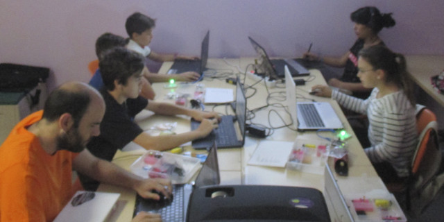
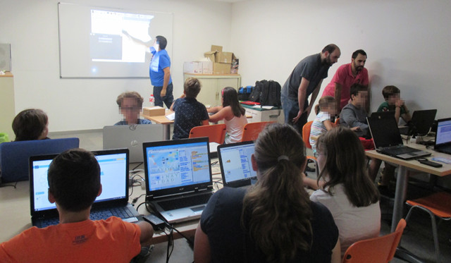
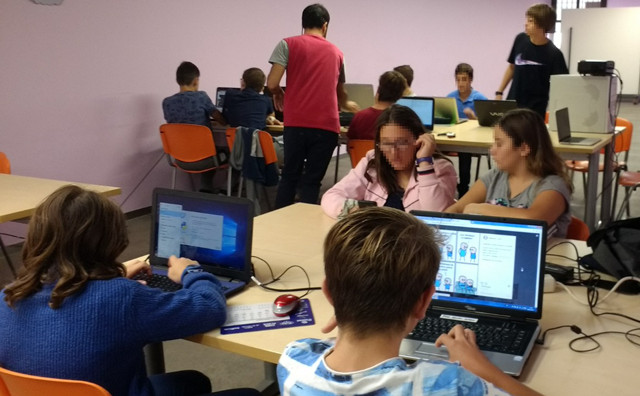
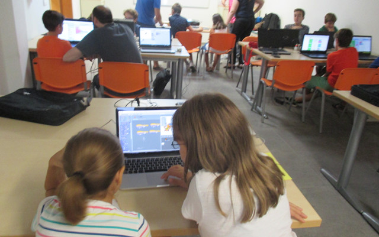
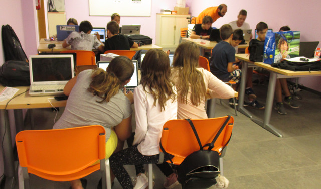

## CoderDojo Murcia

[CoderDojo](https://coderdojo.com/) es una iniciativa sin ánimo de lucro nacida en Irlanda en 2011 que promueve el despliegue de clubes gratuitos de programación. Los clubes CoderDojo son organizados y gestionados por mentores voluntarios que dedican parte de su tiempo libre para guiar a los ninjas en el aprendizaje de las diferentes disciplinas y lenguajes de programación.

### Conoce CoderDojo

  <iframe src="//www.youtube.com/embed/1YDcXzvvauM" allowfullscreen></iframe>

 

## Ninjas (Participantes)

Los ninjas (niños, niñas y jóvenes de 10 a 17 años) aprenden a programar en un entorno abierto e informal siguiendo su ritmo de aprendizaje. Para asistir a los talleres tienes que enviarnos un email accediendo al formulario de [contacto](https://www.programoergosum.es/contacto/) y te indicaremos los pasos a seguir.

> En estos momentos disponemos de una lista de espera para poder asistir a los talleres como ninja.

 

## Mentores (Voluntarios)

También pueden participar adultos con conocimientos en programación, electrónica o robótica como mentores voluntarios.

> Si eres estudiante de la Universidad de Murcia y participas como voluntario obtendrás créditos CRAU.

 

## Centro Municipal 585m2

Los talleres se realizan el primer y tercer sábado de cada mes (salvo festivos) de 11:00h a 13:00h en el Centro Municipal 585m2 de Murcia.

La organización de los talleres funciona de la siguiente manera; dependiendo del número de mentores disponibles se asigna el número de plazas, es decir, intentamos que asistan 5 ninjas por cada mentor, de esta forma en caso de disponer de 3 mentores se avisarían a 15 ninjas por orden de inscripción.

 

## Precio

Los talleres son **totalmente gratuitos** ya que es una iniciativa donde los mentores dedican parte de su tiempo libre para guiar a los ninjas en el aprendizaje de las diferentes disciplinas y lenguajes de programación. Además, los ninjas deberán llevar obligatoriamente un ordenador portátil. También pueden llevar material de electrónica o robótica (si los tuvieran) para compartir con el resto de sus compañeros.

 

## Patrocina

El Ayuntamiento de Murcia cede el Centro Municipal 585m2 Espacio Joven para la realización de los talleres, así como la posibilidad de utilizar la WiFi del centro. Los materiales de electrónica y robótica utilizados en los talleres han sido adquiridos gracias a *subvenciones concedidas para el fomento de la participación juvenil en el municipio de Murcia por la Concejalía de Juventud del Ayuntamiento de Murcia*.

